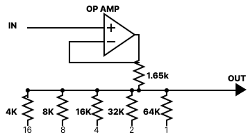
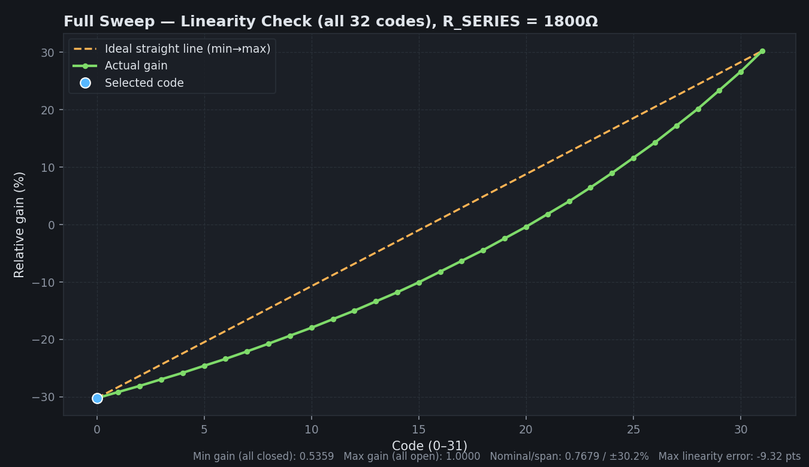

# Gain Ladder Calculator — Help

**File:** `gain-ladder-calculator.html`
**What it does:** Live calculator for the binary-weighted resistor ladder gain-control network (5 switched resistors + series resistor into a non-inverting op-amp stage), plus a lookup-table generator that maps the firmware's `tiltGainRange` codes onto the closest achievable hardware state.

Open the HTML file in any browser — no install, no server. This same content is also built into the tool itself: click **"? Help"** top-right for a pop-up version that never goes out of sync with what the tool is actually calculating.

> **Update:** default `R_SERIES` is now **1800Ω** (previously 1500Ω/1650Ω were tried). This gets the achievable span to ±30.2%, much closer to the firmware's ±32% target. All numbers and charts below reflect 1800Ω.

---

## 1. The circuit



A series resistor (`R_SERIES`, now **1800Ω**) feeds a junction where five resistors (`R176, R171, R170, R169, R168`) can each be independently switched to ground. Whichever combination is grounded sets the divider ratio, which sets the op-amp's gain.

Each resistor is either:
- **Grounded ("on")** — contributes its conductance (`1/R`) to the parallel combination, or
- **Open ("off")** — contributes nothing.

With 5 independent on/off switches, there are **2⁵ = 32 possible combinations**, each producing one distinct gain value. That number — 32 — is the hard ceiling on resolution. No amount of firmware or math changes it; it's set by the resistor count.

---

## 2. The math

For a given 5-bit hardware state (bit 4 = R176 … bit 0 = R168), with bit = 1 meaning "grounded":

```
1/R_parallel = Σ (1/R_i) for every grounded resistor i
R_parallel   = 1 / (1/R_parallel)          [∞ if nothing is grounded]
Gain         = R_parallel / (R_SERIES + R_parallel)
```

- **All 5 grounded** → smallest `R_parallel` → **minimum gain**
- **All 5 open** → `R_parallel = ∞` → **maximum gain (1.0)**

Across the 32 states, gain increases monotonically as fewer resistors are grounded. That monotonicity is what guarantees the lookup table can never produce an out-of-order jump like the 15→16 reversal seen in the earlier table — a correctly-built nearest-match search is mathematically incapable of doing that.

**Nominal gain** = midpoint between the min and max achievable gain.
**Relative gain (%)** = `(Gain − Nominal) / Nominal × 100`, i.e. how far a given state sits from center.

---

## 3. The firmware table (`tiltGainRange`)

The firmware expects **65 discrete codes** (`decV` from −32 to +32, hex `0x00`–`0x40`, 8-bit binary). The tool takes that array as-is — no values in it are altered — and for every code:

1. Computes the target gain: `nominal × (1 + decV/100)`
2. Searches all 32 achievable hardware states for the closest actual gain
3. Reports the hardware state, the actual %, and the error in percentage points (pp)

---

## 4. Two different "error" numbers — don't mix them up

The tool reports linearity/error in two places that measure **different things**. Mixing them up is the fastest way to think the numbers are wrong when they're not.

### a) Full Sweep panel — error vs. a straight line (hardware-only, no firmware involved)
Plots **raw achievable gain** across the **32 physical codes (0–31)** against a straight reference line drawn from code 0 to code 31. This has nothing to do with the firmware's 65-code table — it's purely "how non-linear is this resistor network by itself."



| Metric | Value (R_SERIES = 1800Ω) |
|---|---|
| Min gain (all closed) | 0.5359 |
| Max gain (all open) | 1.0000 |
| Nominal / achieved span | 0.7679 / ±30.2% |
| **Max linearity error (vs. straight line)** | **−9.32 pts** |

That −9.32 pts is real and expected — the gain formula (`R_parallel / (R_SERIES + R_parallel)`) is a divider, not linear in the switch bits, so raw gain will always bow away from a straight code-to-code line like this. This number describes the network's inherent curvature, not a firmware coverage problem.

### b) Firmware Precision Table panel — error vs. the actual `decV` targets
Compares each of the firmware's **65 target codes** (−32…+32%) to the **nearest achievable** hardware state, in **relative %**, not raw gain. This is the number that answers "will the firmware get the tilt value it asked for."

| Metric | Value (R_SERIES = 1800Ω) |
|---|---|
| Target span (firmware wants) | ±32.00% |
| Achieved span | ±30.22% |
| **Worst-case error (vs. firmware target)** | **+1.78 pp** |
| Mean absolute error (65 codes) | 0.59 pp |

**These two numbers (−9.32 pts vs. +1.78 pp) are not the same measurement and won't match** — one is raw-gain-vs-straight-line over 32 hardware codes, the other is relative-%-vs-firmware-target over 65 firmware codes. If someone quotes a linearity number, ask which panel it came from.

### Quantization and coverage, for the firmware-facing number specifically

### Quantization (expected, unavoidable with 5 resistors)
Adjacent `decV` codes closer together than the actual gain spacing between hardware states will land on the same nearest state — flagged in the table with a faint highlight and a `↔` icon. Normal for a 5-bit network, not a problem by itself.

### Coverage gap (a real design number, worth tracking)
With **R_SERIES = 1800Ω**, achieved span (±30.22%) is close to but still short of the firmware's ±32% target, so the outer few codes clamp to the best available end-state — that's where the +1.78 pp worst-case comes from. Big improvement over the 1500Ω configuration, which had +5.48 pp worst-case and only reached ±26.52%.

**If it still needs closing further**, either:
- Keep tuning resistor values directly in the tool — every chart and stat on this page updates live, no reload needed, or
- Add a 6th switched resistor (2⁶ = 64 states) for both wider span and finer resolution, or
- Move to a true digital potentiometer if the firmware genuinely needs unique values at every one of the 65 codes with no duplicates.

---

## 5. How to use the tool

1. **Top panel** — edit `R_SERIES` and the five resistor values. Toggle switches to manually explore any single state; the code slider steps through all 32.
2. **Full Sweep panel** — shows all 32 raw states against an ideal straight line, for eyeballing linearity independent of the firmware's specific 65-code target.
3. **Firmware Precision Table** — the actual deliverable: paste-proof, matches your `tiltGainRange` array exactly, shows nearest-match hardware state, grounded resistors, and error for every one of the 65 codes. Scroll to check any specific code; red error values and `↔` duplicate flags call out what to double check.

All values recompute live — there's no "recalculate" button, and nothing needs to be reloaded when resistor values change.